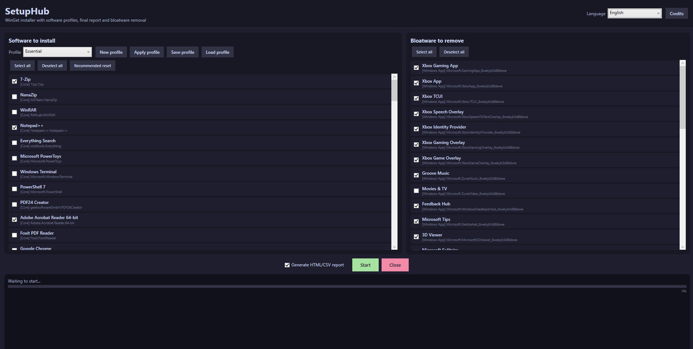
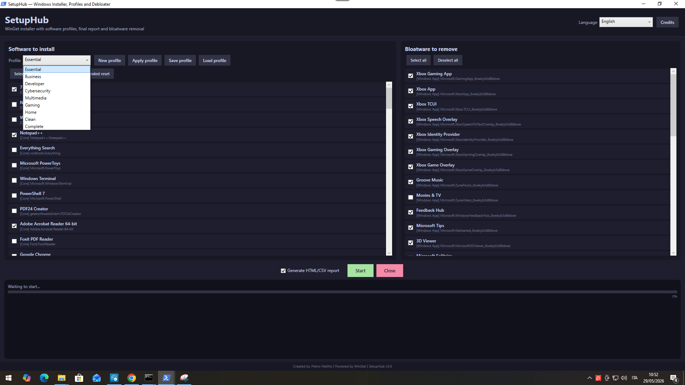

<p align="center">
  
</p>

<p align="center">
  <strong>Windows workstation setup, software profiles, bloatware cleanup, and deployment reporting.</strong>
</p>

<p align="center">
  <a href="./LICENSE">
    
  </a>
  
  
  
</p>

---

# SetupHub

**SetupHub** is a lightweight Windows workstation setup tool built around WinGet, Microsoft Store packages, software profiles, bloatware cleanup, and deployment reporting.

It was created for a practical IT scenario: a fresh or recently reinstalled Windows machine, a list of applications to install, a few unwanted preinstalled apps to remove, and the need to leave behind a clear report of what was done.

<p align="center">
  
</p>

---

## What SetupHub does

SetupHub provides both a modern graphical interface (WPF) and a headless command-line interface (CLI) for preparing Windows 10 and Windows 11 workstations.

It helps you:

- install commonly used applications through WinGet and Microsoft Store sources;
- automatically bootstrap WinGet along with modern **Windows App Runtime 1.8+** dependencies;
- apply predefined or custom software profiles;
- filter software and bloatware in real time with built-in search and category filters;
- remove selected Windows preinstalled apps;
- create an optional **Windows System Restore Point** before making system changes;
- detect pending Windows reboots;
- validate the software catalog before installation;
- collect hardware and software inventory from the machine;
- generate a final deployment report in multiple formats (HTML, CSV, JSON, TXT);
- run interactively with GUI or unattended via CLI parameters for remote/automated deployment (Intune, MDM, SCCM).

SetupHub does **not** bundle third-party installers. Package resolution and installation are handled by the package sources configured on the target machine. This keeps the repository small, easier to review, and more transparent from an operational point of view.

---

## Main features

- **Windows 10 and Windows 11 support**  
  Designed for modern Windows workstations with PowerShell 5.1+ and WinGet available.

- **Resilient WinGet Bootstrap**  
  Includes automatic download and setup for `Microsoft.DesktopAppInstaller` and its prerequisite `Microsoft.WindowsAppRuntime.1.8`, preventing `0x80073CF3` dependency errors on clean systems.

- **GUI and Headless CLI modes**  
  Run interactively with the WPF GUI or pass `-NoGui` for completely unattended scriptable installations.

- **Real-time Search and Category Filtering**  
  Filter the software and bloatware lists instantly by typing package names, IDs, or choosing a category.

- **Bilingual interface**  
  The GUI and logs support both English and Italian.

- **Curated software catalog**  
  Applications are grouped by category, including browsers, office tools, developer tools, cybersecurity utilities, remote support tools, multimedia applications, virtualization tools, and system utilities.

- **Live package validation**  
  Before starting the deployment, SetupHub checks whether each supported package can actually be resolved from the configured WinGet or Microsoft Store source.

- **Predefined profiles**  
  Ready-to-use profiles are available for common workstation scenarios: `Essential`, `Business`, `Developer`, `Cybersecurity`, `Multimedia`, `Gaming`, `Home`, `Clean`, and `Complete`.

- **Custom profiles**  
  New profiles can be created directly from the GUI and saved as JSON in `profiles/` for later use.

- **System Restore Point & Pending Reboot Detection**  
  Optionally creates a Windows Restore Point before installing/debloating and warns about pending Windows updates.

- **Bloatware cleanup**  
  SetupHub removes selected Windows Appx and provisioned packages when present. If a package is already absent, it is recorded as skipped rather than treated as an error.

- **Hardware and software inventory**  
  The final report includes information about the operating system, CPU, memory, disks, volumes, GPU, network adapters, TPM, Secure Boot, Microsoft Defender status, PowerShell, WinGet, and installed software.

- **Deployment reporting**  
  Each run produces HTML, CSV, JSON, and text logs under `reports/`.

---

## Screenshots

The screenshots below show the main workflow: selecting a software profile, validating the catalog, running the deployment, and reviewing the generated report and inventory.

### Main interface

<p align="center">
  
</p>

### Profile selection and custom profiles

<p align="center">
  
</p>

### Catalog validation

<p align="center">
  
</p>

### Deployment report

<p align="center">
  
</p>

### Hardware and software inventory

<p align="center">
  
</p>

---

## Requirements

SetupHub is designed for:

- Windows 10 build 18363 or newer;
- Windows 11;
- PowerShell 5.1 or newer;
- administrator privileges;
- WinGet / Windows Package Manager (bootstrapped automatically if missing);
- Microsoft Store source, when Store-based packages are selected;
- internet access for package validation and download.

---

## Quick start

### Interactive GUI Mode

Clone or download the repository, then start SetupHub from an elevated shell:

```powershell
powershell.exe -NoProfile -ExecutionPolicy Bypass -File .\SetupHub_Setup.ps1
```

You can also use the launcher:

```cmd
Start_SetupHub.cmd
```

### Headless CLI / Unattended Mode

For automated deployments (e.g. Intune, MDM, provisioning USB keys):

```powershell
# Deploy the Developer profile unattended with restore point
powershell.exe -NoProfile -ExecutionPolicy Bypass -File .\SetupHub_Setup.ps1 -Profile Developer -NoGui -CreateRestorePoint

# Deploy the Business profile in English without GUI
powershell.exe -NoProfile -ExecutionPolicy Bypass -File .\SetupHub_Setup.ps1 -Profile Business -NoGui -Language en

# Deploy custom specific packages without GUI
powershell.exe -NoProfile -ExecutionPolicy Bypass -File .\SetupHub_Setup.ps1 -NoGui -InstallIds "Google.Chrome","7zip.7zip","Git.Git"
```

#### CLI Parameters

| Parameter | Type | Description |
| :--- | :--- | :--- |
| `-Profile <name>` | String | Profile to apply (`Essential`, `Business`, `Developer`, `Cybersecurity`, `Multimedia`, `Gaming`, `Home`, `Clean`, `Complete`, or custom profile name). |
| `-NoGui` | Switch | Run directly in console without launching the WPF interface. |
| `-CreateRestorePoint` | Switch | Creates a Windows System Restore Point prior to operations. |
| `-Language <it\|en>` | String | Sets UI/console language (`it` or `en`). |
| `-SkipValidation` | Switch | Skips Phase 0 catalog validation. |
| `-NoInventory` | Switch | Skips hardware and software inventory collection. |
| `-NoReport` | Switch | Skips generating report files in `reports/`. |
| `-InstallIds <id1,id2>` | Array | Specific list of WinGet package IDs to install. |
| `-BloatIds <id1,id2>` | Array | Specific list of AppX package IDs to remove. |

---

## Reports

Each run creates a timestamped report set under the `reports` folder:

```text
SetupHub_Report_<timestamp>.html
SetupHub_Report_<timestamp>.csv
SetupHub_Report_<timestamp>.json
SetupHub_Log_<timestamp>.txt
SetupHub_SystemInventory_<timestamp>.json
SetupHub_InstalledSoftware_<timestamp>.csv
SetupHub_CatalogAudit_<timestamp>.json
SetupHub_CatalogAudit_<timestamp>.csv
SetupHub_ManualUnsupported_<timestamp>.json
SetupHub_ManualUnsupported_<timestamp>.csv
```

The report includes:

- installation results and command lines;
- package validation status and exit codes;
- bloatware cleanup results;
- WinGet logs for each package;
- hardware inventory and system information;
- disks, volumes, and network adapters;
- TPM, Secure Boot, and Microsoft Defender status;
- installed desktop software inventory.

---

## Security model

SetupHub does not host third-party installers in this repository.

It asks WinGet or Microsoft Store to resolve and install packages from the target machine. This design has two practical consequences:

1. the repository remains small and reviewable;
2. package availability depends on the target machine, configured sources, vendor manifests, and network conditions.

---

## License

SetupHub is released under the **GNU General Public License v3.0 only**.

SPDX identifier:

```text
GPL-3.0-only
```

See [`LICENSE`](./LICENSE) for the full license text.

---

## Credits

Created and maintained by **Pietro Melillo**.

- Email: `melillopietro@gmail.com`
- Website: `https://melillopietro.github.io/`
- LinkedIn: `https://it.linkedin.com/in/melillopietro`
