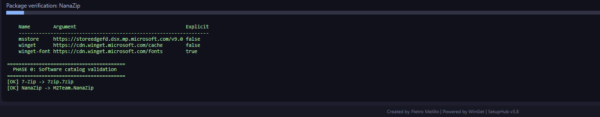
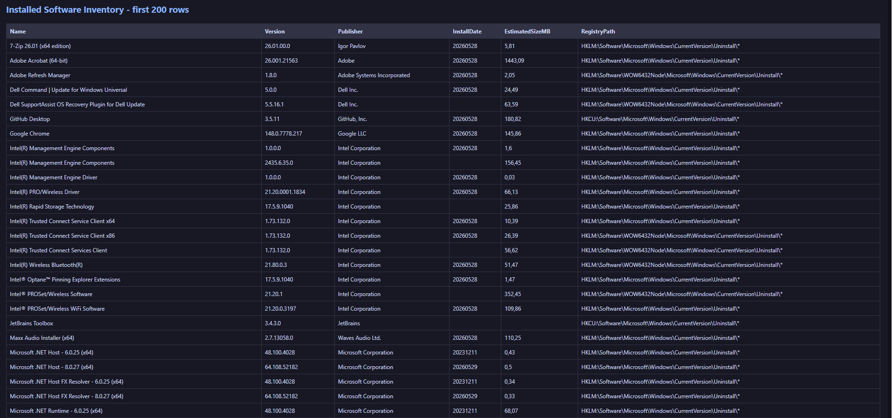
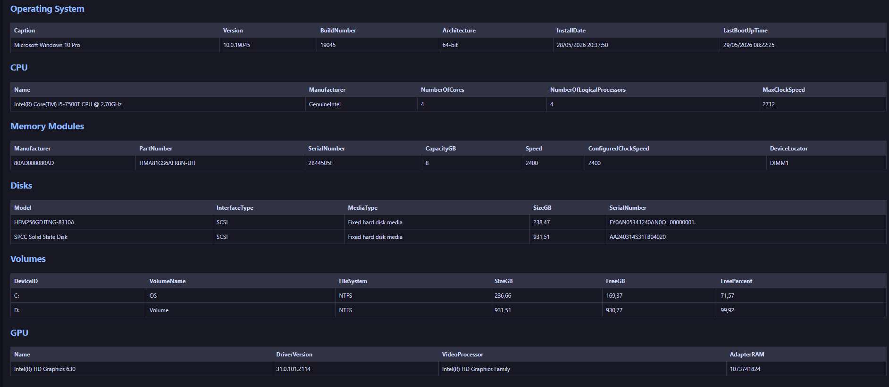

# SetupHub

**SetupHub** is a small Windows workstation setup tool built around WinGet, Microsoft Store packages, software profiles, bloatware cleanup, and deployment reporting.

It is meant for the practical moment everyone in IT knows well: a fresh or recently reinstalled Windows machine, a list of tools to install, a few unwanted apps to remove, and the need to leave behind a clear report of what was done.

<p align="center">
  
</p>

<p align="center">
  <a href="LICENSE"></a>
  
  
  
</p>

---

## What SetupHub does

SetupHub provides a graphical interface for preparing Windows 10 and Windows 11 workstations. It lets you select software from a curated catalog, apply predefined or custom installation profiles, remove common Windows preinstalled apps, and generate a final report with both deployment results and machine inventory.

The tool does not bundle third-party installers. Package resolution and installation are handled through WinGet and Microsoft Store sources available on the target machine. This keeps the project lightweight and makes the final result easier to audit.

## Main features

- **Bilingual interface**: Italian and English can be selected from the GUI.
- **Software catalog**: common applications grouped by category, including browsers, office tools, developer tools, cybersecurity utilities, remote support tools, multimedia apps, and system utilities.
- **Live package validation**: before running the deployment, SetupHub checks whether catalog packages are actually available through the configured WinGet or Microsoft Store source.
- **Predefined profiles**: ready-to-use software selections for common workstation scenarios.
- **Custom profiles**: create, save, and reload your own software profiles directly from the GUI.
- **Bloatware cleanup**: removes selected Windows Appx/provisioned packages when they are present, and skips them cleanly when they are already absent.
- **Hardware and software inventory**: collects key information about the machine and includes it in the final report.
- **Deployment report**: exports HTML, CSV, JSON, and text logs.
- **Manual / unsupported section**: tracks software that should not be installed automatically because the WinGet package is unavailable, unstable, vendor-restricted, or better handled manually.
- **Credits and license page**: author, website, license, and copyright information are included in the application and report.

---

## Screenshots

The screenshots below show the main workflow: selecting a software profile, validating the catalog, running the deployment, and reviewing the generated inventory/report.

> The image files are stored in `assets/screenshots/`. Keep the names exactly as shown below: GitHub paths are case-sensitive.

### Main interface

<p align="center">
  
</p>

### Profile selection and custom profiles

<p align="center">
  
</p>

### Catalog validation

<p align="center">
  
</p>

### Deployment report

<p align="center">
  
</p>

### Hardware and software inventory

<p align="center">
  
</p>

Before publishing screenshots, remove or blur private information such as serial numbers, internal hostnames, public IP addresses, private IP addresses, MAC addresses, usernames, and local report paths.

---

## Requirements

SetupHub is designed for:

- Windows 10 build 18363 or newer
- Windows 11
- PowerShell 5.1 or newer
- Administrator privileges
- WinGet / Windows Package Manager
- Internet access for package download and source validation

Some packages may require additional conditions such as a vendor account, a Microsoft account, a Microsoft 365 license, or an interactive installer flow controlled by the publisher.

---

## Quick start

Clone or download the repository, then start SetupHub from an elevated shell.

```powershell
powershell.exe -NoProfile -ExecutionPolicy Bypass -File .\SetupHub_Setup.ps1
```

You can also use the launcher:

```cmd
Start_SetupHub.cmd
```

SetupHub will request elevation if it is not already running as administrator.

---

## Recommended workflow

1. Start SetupHub as administrator.
2. Choose the interface language.
3. Select a predefined profile or create a new custom profile.
4. Review the software selection.
5. Review the bloatware cleanup section.
6. Start the deployment.
7. Wait for validation, installation, cleanup, and inventory collection.
8. Open the generated HTML report from the `reports` folder.
9. Keep the report internally if needed, but do not publish it without redacting sensitive host information.

---

## Profiles

Profiles are simple software selections that help prepare different kinds of workstations faster.

Typical use cases include:

- a basic office workstation;
- a developer machine;
- a cybersecurity analysis workstation;
- a multimedia workstation;
- a clean Windows setup with only essential tools.

Custom profiles are stored in the `profiles` folder. They can be created directly from the GUI with the **New profile** button, then updated with **Save profile**.

---

## Package validation

Every run includes a catalog validation phase. SetupHub checks whether each supported package can be resolved through the configured source before treating it as installable.

Packages that cannot be resolved are not counted as failed installations. They are marked separately so the final report remains clean and meaningful.

This is important because WinGet package identifiers and vendor installers can change over time. A package that was valid today may be renamed, removed, replaced, or temporarily unavailable later.

---

## Bloatware cleanup

SetupHub handles Windows preinstalled apps through Appx and provisioned package checks.

When a selected app exists, SetupHub attempts to remove it. When it does not exist, the result is recorded as already absent instead of being treated as an error.

This avoids false failures on machines that are already clean, have been customized by OEM images, or use a Windows edition where certain apps are not present.

---

## Reports

Each run creates a timestamped report set under `reports/`.

Typical outputs include:

```text
SetupHub_Report_<timestamp>.html
SetupHub_Report_<timestamp>.csv
SetupHub_Report_<timestamp>.json
SetupHub_Log_<timestamp>.txt
SetupHub_SystemInventory_<timestamp>.json
SetupHub_InstalledSoftware_<timestamp>.csv
SetupHub_CatalogAudit_<timestamp>.json
SetupHub_CatalogAudit_<timestamp>.csv
SetupHub_ManualUnsupported_<timestamp>.json
SetupHub_ManualUnsupported_<timestamp>.csv
```

The report includes:

- installation results;
- package validation status;
- bloatware cleanup results;
- command executed for each operation;
- exit codes;
- WinGet logs where available;
- hardware inventory;
- operating system information;
- disks and volumes;
- network adapters;
- TPM and Secure Boot status;
- Microsoft Defender status where available;
- installed desktop software inventory.

Do not commit generated reports to the repository. They may contain machine-specific data.

---

## Manual and unsupported packages

Some tools are intentionally kept out of the automatic installation catalog. This can happen when the package is not consistently available through WinGet, when the vendor requires a portal login, or when the product is distributed as a portable archive rather than a standard installer.

Examples may include products such as Ghidra, VMware Workstation, or GPU-vendor tools depending on the current package ecosystem and the target machine.

These applications are documented in the report but are not treated as deployment errors.

---

## Repository layout

```text
SetupHub/
├── SetupHub_Setup.ps1
├── Start_SetupHub.cmd
├── README.md
├── LICENSE
├── NOTICE.md
├── CHANGELOG.md
├── SECURITY.md
├── CONTRIBUTING.md
├── .gitignore
├── assets/
│   └── screenshots/
├── docs/
│   └── SCREENSHOTS.md
├── profiles/
└── reports/
```

The `reports` folder is ignored by Git except for the placeholder file. Keep reports local unless you have removed sensitive data.

---

## Security model

SetupHub does not host third-party installers in this repository. It asks WinGet or Microsoft Store to resolve and install packages from the target machine.

That design has two practical consequences:

1. the repository remains small and reviewable;
2. package availability depends on the target machine, configured sources, vendor manifests, and network conditions.

Always test the tool on a non-critical machine before using it in production or on multiple endpoints.

---

## License

SetupHub is released under the **GNU General Public License v3.0 only**.

SPDX identifier:

```text
GPL-3.0-only
```

In simple terms, you may use, study, share, and modify the code. If you distribute a modified version, the modified version must remain under the same license and the corresponding source code must remain available under GPL-3.0-only.

See [`LICENSE`](LICENSE) for the full license text.

---

## Credits

Created and maintained by **Pietro Melillo**.

- Email: `melillopietro@gmail.com`
- Website: `https://melillopietro.github.io/`
- Linkedin `https://it.linkedin.com/in/melillopietro`

---

## Disclaimer

SetupHub is provided without warranty. It changes the state of the local machine by installing software and removing selected Windows apps. Review the selected items before running it, and test it before using it in managed environments.
